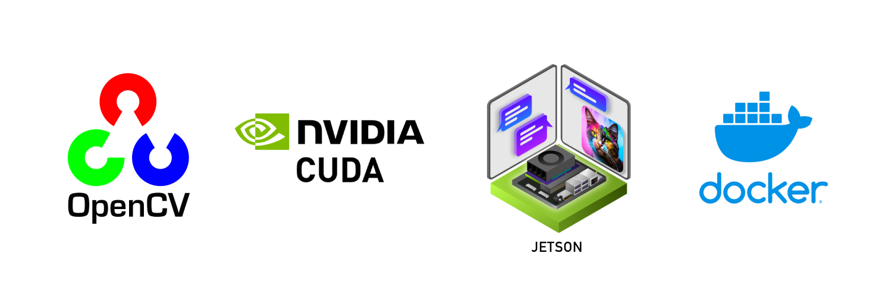

# OpenCV with CUDA enabled for Jetson

⚠️ LOOKING FOR MANTAINERS ⚠️
Just open an issue and let's talk :)

You can find the image on [docker hub](https://hub.docker.com/r/federicolanzani/opencv-cuda-jetson).

If you need a docker image like this one but not for jetson, this repo has a [twin](https://github.com/lanzani/opencv-cuda-docker)!


> Feel free to open an issue if you are having some problems. 
> 
> Nvidia ecosystem can be quite difficult, I know.

**Note:** This image works properly **only** on Jetson nano, TX2, AGX Xavier, Xavier NX, (not yet but soon: AGX Orin, Orin NX, Orin nano)

# What's inside the image?
- l4t-base:r32.7.1 (Jetpack 4.6.x)
- Python 3.6
- Opencv 4.8.0
- Numpy

**Details:**
- cuda version: 10.2
- cudnn version: 8.2

For details on opencv build you can check the [build script](/ubuntu-18.04/build_opencv/build_opencv.sh).

**Base Images:** 
- Build: made on jetson without docker
- Runtime: nvcr.io/nvidia/l4t-base:r32.7.1

# Why not jetson-containers?
If you are familiar with the jetson environment you are probably asking why I made this image and not used [dustynv/opencv](https://hub.docker.com/r/dustynv/opencv)

The reasons are:
- I have to use opencv version 4.8.0 (in [dustynv/opencv](https://hub.docker.com/r/dustynv/opencv) opencv version is 4.5.0)
- I wanted to have more control on the image

# Setup
Before running the docker image on jetson device, make sure that you have docker runtime nvidia inplace:
1. Open: `sudo nano /etc/docker/daemon.json`
2. Edit from:
    ```json
    {
        "runtimes": {
            "nvidia": {
                "path": "nvidia-container-runtime",
                "runtimeArgs": []
            }
        }
    }
    ```

   To:
    ```json
    {
        "runtimes": {
            "nvidia": {
                "path": "nvidia-container-runtime",
                "runtimeArgs": []
            }
        },
    
        "default-runtime": "nvidia"
    }
    ```
3. Restart docker: `sudo systemctl restart docker`

Then add user to docker group 
1. `sudo usermod -aG docker $USER`
2. `sudo reboot`

# Run
See [docker-compose](/ubuntu-18.04/docker-compose.yml). 

To run with window:
from jetson:
1. export DISPLAY=:0
2. xhost +


# Install

# Build
1. go to X/build_opencv where X is whatever origin folder
2. `docker build .`
3. Once finished (on jetson nano it will take 7h) run the docker with a shared folder (to get the build files)
   `docker run -v HOST/X/installer:/shared -i -t tag bash`
4. Copy built packages from docker to host machine
   `cp OpenCV-4.8.0-aarch64.* /shared/`

# Video tutorials
- [OpenCV with CUDA in Python on Jetson](https://www.youtube.com/watch?v=BCNnqTFi-Gs)
- [Packaging OpenCV with CUDA - Install on Jetson](https://www.youtube.com/watch?v=nBLLVj37M1w)

# Useful resources
- [dusty-nv/jetson-containers](https://github.com/dusty-nv/jetson-containers)
- [mdegans/nano_build_opencv](https://github.com/mdegans/nano_build_opencv)
